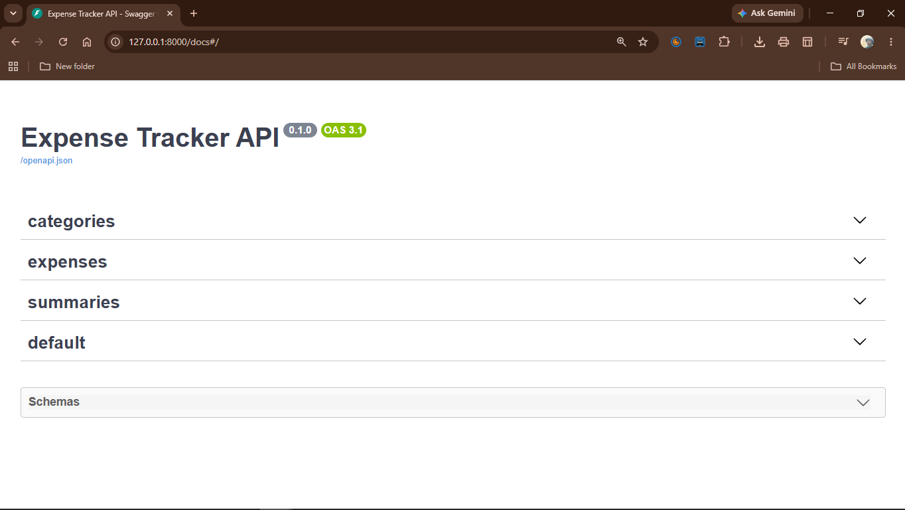

# Expense Tracker API

A REST API for recording personal expenses and summarising them by month and category.

## Problem

Spreadsheets work for tracking spending but are hard to query, validate and automate. This API stores expenses in a database with enforced rules (positive amounts, valid dates, existing categories) and exposes endpoints for filtering and summarising them.

## Features

- Create, read, update and delete expenses
- Create, list and delete categories (names are unique; a category that still has expenses cannot be deleted)
- List expenses filtered by date range and category, newest first, with limit/offset pagination
- Monthly summary: total, count and per-category breakdown
- Spending per category over an optional date range
- Input validation and consistent status codes (404, 409, 422)
- Interactive API documentation at `/docs`
- Automated tests (pytest)

## Tech Stack

- Python, FastAPI, Uvicorn
- SQLite with SQLAlchemy (ORM)
- Pydantic and pydantic-settings
- pytest for tests, Ruff for linting

## Architecture

A request goes through three layers:

1. **Pydantic schemas** validate the request body and query parameters. Invalid input is rejected with a 422 before any of our code runs.
2. **Routers** (one per resource) hold the endpoint logic and talk to the database through a SQLAlchemy session.
3. **SQLite** stores the data. The schema is created on startup from the SQLAlchemy models.

Routers use the session through FastAPI's `Depends(get_db)`, so each request gets its own session, closed after the response. Tests replace `get_db` with one that points at an in-memory database.

## Project Structure

```
app/
  main.py          app creation, startup, router registration
  config.py        settings (database URL) read from environment / .env
  database.py      engine, session dependency, SQLite foreign key setting
  models.py        SQLAlchemy tables: Category, Expense
  schemas.py       Pydantic request and response models
  routers/         categories.py, expenses.py, summaries.py
tests/
  conftest.py      test client backed by an in-memory database
  test_*.py        tests for each router
```

## Setup

Developed and tested with Python 3.14.

```bash
git clone <repository-url>
cd expense-tracker-api
python -m venv .venv
```

Activate the virtual environment:

```bash
# Windows PowerShell
.venv\Scripts\Activate.ps1

# macOS / Linux
source .venv/bin/activate
```

Install dependencies and start the server:

```bash
pip install -r requirements.txt
uvicorn app.main:app --reload
```

The API runs at `http://127.0.0.1:8000`. Open `http://127.0.0.1:8000/docs` for the interactive documentation.

The database is a SQLite file (`expenses.db`) created on first start. To change its location, copy `.env.example` to `.env` and edit `DATABASE_URL`.

## Usage



Create a category, then an expense in it:

```
POST /categories
{"name": "Food"}

POST /expenses
{"amount": "12.50", "description": "Lunch", "spent_on": "2026-09-30", "category_id": 1}
```

Query expenses and summaries:

```
GET /expenses?start=2026-09-01&end=2026-09-30&category_id=1&limit=20&offset=0
GET /summaries/monthly?year=2026&month=9
GET /summaries/by-category?start=2026-01-01&end=2026-12-31
```

Amounts are sent and returned as decimal strings such as `"12.50"`.

## Testing

```bash
pip install -r requirements-dev.txt
python -m pytest
```

Tests run against an in-memory SQLite database, so they never touch `expenses.db`.

## Design Decisions

- **Money is stored as integer cents.** Floats cannot represent values like 0.1 exactly, so sums drift. With integer cents, SQL's `SUM()` is exact. The API still sends and returns decimals like `"12.50"`; the conversion happens in `to_cents` and `to_read_model` in `app/routers/expenses.py`. The schema allows at most two decimal places, so nothing is rounded away.
- **Categories are a table, not a free-text field.** This prevents typos like "Food" and "Fod" and makes a category a single thing to manage. The cost is a rule: a category that still has expenses cannot be deleted (409).
- **The foreign key is enforced by the database.** SQLite ignores foreign keys unless `PRAGMA foreign_keys=ON` is set on each connection, so `database.py` sets it. Without it, a category could be deleted while expenses still pointed at it.
- **No service layer.** Each endpoint is short enough to live in its router. The summary query is the most complex piece and is a single function in `summaries.py`.
- **Limit/offset pagination** maps directly onto SQL `LIMIT` and `OFFSET` and is easy to reason about.

## Limitations

- Single user only: there is no authentication.
- One currency, with no conversion.
- Category names are case-sensitive, so "Food" and "food" are different categories.
- Categories cannot be renamed, only created and deleted.
- The database schema is created with `create_all`, which cannot change an existing table. There are no migrations, so changing a model means deleting `expenses.db`.
- With limit/offset pagination, a client paging through the list can see an item twice or miss one if expenses are added between requests.
- Error responses are not uniform in shape: 404 and 409 return `detail` as a string, while 422 returns it as a list.
- Tested with Python 3.14 on Windows only.

## Future Improvements

- Rename endpoint for categories, and case-insensitive category names
- Database migrations with Alembic
- CSV export of expenses
- Authentication, if it ever needs more than one user

## License

MIT. See [LICENSE](LICENSE).